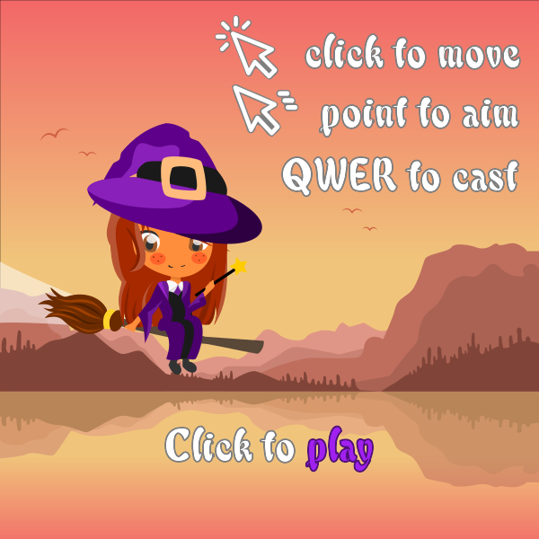
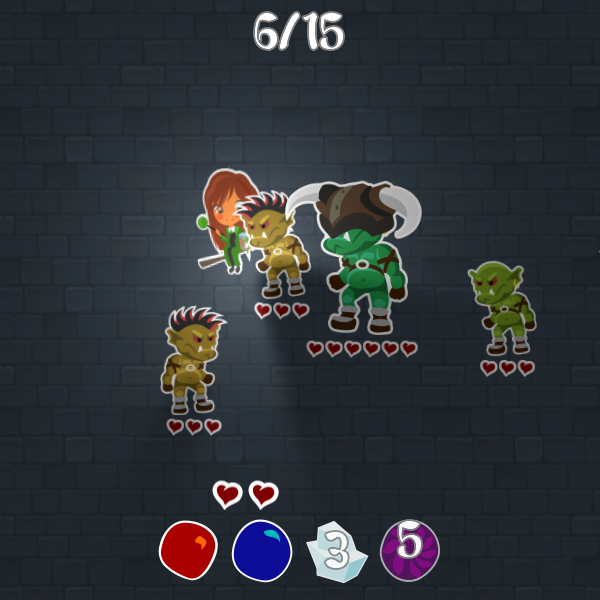

# BialJam'17

**Outlive the horde!**

You're a witch. A goblin horde is after you. Survive as long as you can! Plan your actions carefully - your spells need
some time to recharge!

## About

Created in under 40 hours (minus sleep) on game jam organized by the *Bialystok University of Technology* by a single
Java backend developer and a cute graphics designer. The jam's topic was *10 seconds* - hence the 10 seconds delay on
spell usage.

**We won!** Somehow.

- [@czyzby](https://github.com/czyzby): coding, game idea, some graphics (the ugly ones).
- [@marsza](https://github.com/marszaa): most graphics (the pretty ones).

We didn't have enough time to finish everything by ourselves - the background, some simple graphics and sounds were
taken from the [OpenGameArt](https://opengameart.org/). Sprites and spell special effects are all custom, although some
designs were based on existing artworks.

Initially, we planned on creating a tower defense game where you have 10 seconds to build the base and survive through
a 10 seconds wave of chicken siege. It was only after 8 hours of the jam that we came up with this concept. The initial
commits contain some code and assets from the previous project - it was continued by a part of our 4 person team
[in this repository](https://github.com/czyzby/bialjam-17/).

## Assets

Well, it _was_ a game jam with a limited time frame. The project includes examples of poor code reuse, the worst usage
of OOP there is, coroutines overuse, loading assets on demand (not via an asynchronous asset manager), and so on. It
isn't exactly a prime example of a well-structured [KTX](https://github.com/libktx/ktx) game and of what the framework
can do, but - well - it got the job done. Don't judge me by this code.

### Licensing

You can use the code in **commercial** projects (if you are really brave), as long as you release the sources under the
same license. Graphics are published under [CC BY-NC-SA 4.0](https://creativecommons.org/licenses/by-nc-sa/4.0/)
license: you can use them in **non-commercial** projects as long as you credit the authors (make sure to link to this
repository) and release your assets on the same license.

